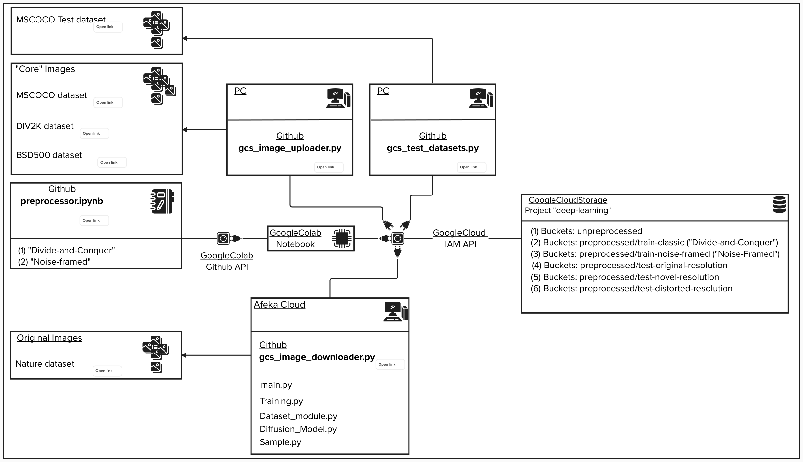

# Architecture overview

# Artefacts overview
- Directory `assets`: includes resources that are neither code, nor dataset related. For example, images that assist in project description.
- Directory `config`: includes files with configurations for during runtime. For example, source and target destinations, machine specifications and more.
- Directory `credentials`: includes files that grant access to resources such as `Google Cloud Services`.
- Directory `image_abyss`: includes images that are collected from various sources. Its basically a large "hole" of items that our `Preprocessor` reads and transforms into viable model input.  
- Directories `image_test_distorted`, `image_test_novel`, `image_test_original`: include different types of test images.
- Directory `src`: includes mostly code and its related items. You can find there implementations such as image uploader to `GCS buckets`,
image downloader from `GCS buckets`, `Preprocessor` and more.

# Project Requirements
Project was developed in `Python3.X` environment.

We suggest to initialize `Python venv` prior to installing required modules and `PIP` for module management.  
The following modules are required for scripts, such as images uploader/downloader to and from `GCS buckets`:
* `google-cloud-storage`
* `pillow`

The notebooks, for example `preprocessor.ipynb`, are expected to run in environments like `Google Colab`. Hence, their code is written under this assumption.
